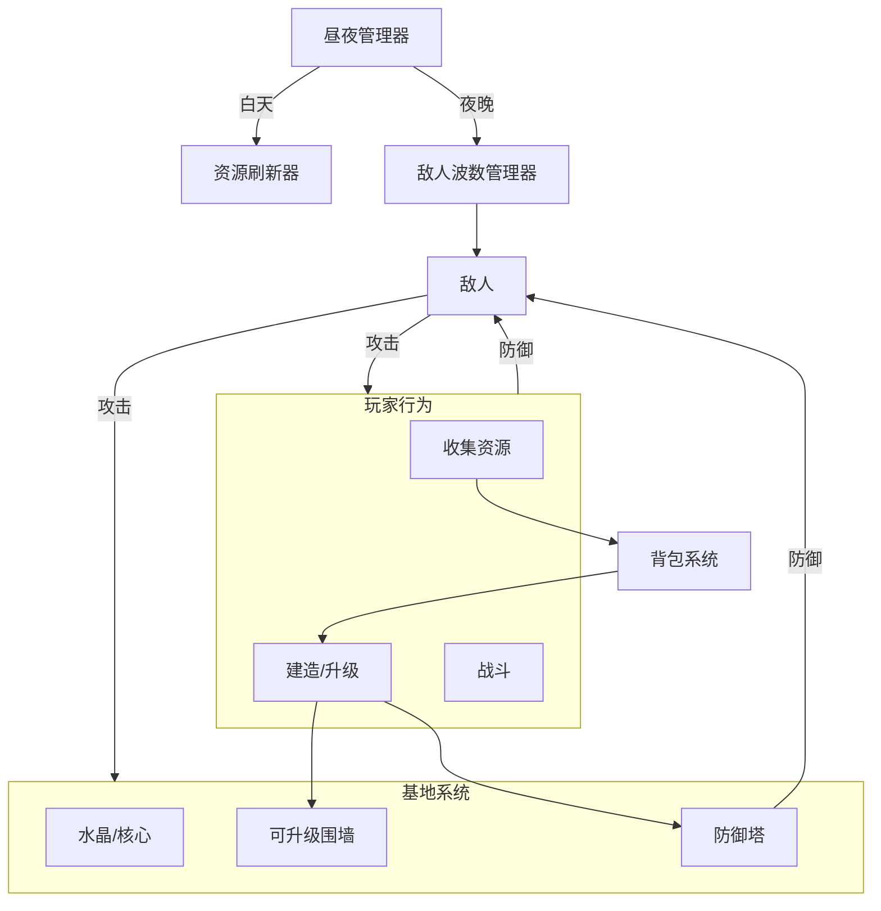

# 2.5D 生存塔防游戏开发计划 (剩余 34 天)

本计划将剩余的 34 天划分为多个 5 天的冲刺阶段（Sprint），优先构建最小可行性产品（MVP），然后再逐步增加复杂度。这个设计完美契合了“白天探索收集 + 夜晚塔防生存”的核心循环，并且非常适合作为 Final Year Project，能够展现你在系统解耦、数据驱动和 AI 状态机方面的技术能力。

## 核心架构图

---

## Sprint 1: 核心循环与昼夜更替 (第 1-5 天)
**目标：** 建立游戏的基本节奏和资源收集闭环。

*   **第 1 天：** 实现 `DayNightManager`。创建一个简单的计时器，在“白天”和“夜晚”状态之间切换，并触发相应的事件（例如：改变全局光照强度）。
*   **第 2 天：** 实现可破坏的资源（树木/石头）。复用现有的 `Health.cs` 和 `WorldItemPickup`。当树木血量归零时，生成木材掉落物。
*   **第 3 天：** 实现 `ResourceSpawner`。在地图的“中环”和“外环”定义刷新点。在每天“白天”开始时触发资源刷新。
*   **第 4 天：** 修改 `WarriorController` AI。将其首要目标改为基地水晶。只有当玩家攻击它或靠得非常近时，才转而攻击玩家。
*   **第 5 天：** 实现基础的 `WaveManager`。在“夜晚”开始时，在地图边缘生成基础的 Warrior 敌人，并确保它们能寻路走向水晶。

## Sprint 2: 基地建造与经济系统 (第 6-10 天)
**目标：** 允许玩家消耗资源来建造防御设施。

*   **第 6 天：** 实现 `BuildManager`（虚影放置）。允许玩家按 B 键进入建造模式，鼠标跟随显示一个半透明的防御塔虚影，并可选择吸附到网格。
*   **第 7 天：** 实现资源消耗逻辑。将 `BuildManager` 连接到 `Inventory`，在放置建筑时扣除对应的木材/石头。
*   **第 8 天：** 创建基础的 `Turret`（防御塔）逻辑。使用 `Physics2D.OverlapCircle` 寻找范围内的敌人，并实例化简单的子弹 Prefab 进行攻击。
*   **第 9 天：** 实现基地水晶（Base Crystal）。给它挂上 `Health.cs`，并在其被摧毁时触发 Game Over。
*   **第 10 天：** 实现商人 NPC。做一个简单的 UI，白天时可以打开，允许玩家将怪物掉落的材料卖出换取金币。

## Sprint 3: 基地扩张与升级 (第 11-15 天)
**目标：** 实现“花钱扩大领地”的机制。

*   **第 11 天：** 设计基地布局。创建 Tier 1（1级）、Tier 2、Tier 3 的围墙/边界 Prefab。
*   **第 12 天：** 实现基地升级终端。在水晶旁边放一个可交互的物体，玩家可以花费金币/资源来升级基地等级。
*   **第 13 天：** 实现领地扩张逻辑。当基地升级时，禁用 Tier 1 的围墙，启用 Tier 2 的围墙，从而扩大玩家的安全建造区域。
*   **第 14 天：** 添加防御塔升级功能。允许玩家与已建好的防御塔交互，花费资源升级它们的伤害或射程。
*   **第 15 天：** 打磨建造放置规则。确保玩家不能在当前领地等级之外建造，也不能堵死关键通道。

## Sprint 4: 敌人多样性与难度递增 (第 16-20 天)
**目标：** 让每个夜晚变得越来越具有挑战性。

*   **第 16 天：** 创建敌人变体 1（快速/脆弱）。调整现有 Warrior 的移动速度、血量和颜色。
*   **第 17 天：** 创建敌人变体 2（坦克/缓慢）。调整体积、血量、攻击力和颜色。
*   **第 18 天：** 更新 `WaveManager` 以支持难度递增。根据当前生存的“天数”，增加敌人的生成数量，并混合生成不同类型的敌人。
*   **第 19 天：** 实现“血月 (Blood Moon)”事件逻辑。每隔 7 天触发一次，改变天空颜色（红色光照），并大幅增加刷怪量。
*   **第 20 天：** 创建精英 Boss（用于血月）。拥有极高的血量和伤害，死亡后掉落稀有战利品。

## Sprint 5: UI、反馈与打磨 (第 21-25 天)
**目标：** 让游戏感觉完整，并向玩家提供清晰的信息。

*   **第 21 天：** 构建 HUD（主界面）。显示当前天数、距离下一阶段的倒计时、水晶血量和玩家金币。
*   **第 22 天：** 添加战斗反馈。实现伤害飘字、受击闪白（如果还没做的话），以及重击时的屏幕震动。
*   **第 23 天：** 添加建造反馈。放置建筑时的音效，基地升级时的粒子特效。
*   **第 24 天：** 实现 Game Over 和 胜利/结算 画面。显示玩家生存的天数和击杀的敌人数量。
*   **第 25 天：** 音频处理。添加背景音乐（白天和夜晚不同），以及攻击、受伤、UI 点击的基础音效。

## Sprint 6: 测试与数值平衡 (第 26-30 天)
**目标：** 确保游戏好玩，难度曲线平滑。

*   **第 26-28 天：** 深度测试核心循环。平衡资源的掉落率、建筑的消耗成本、防御塔的伤害以及敌人的血量。
*   **第 29-30 天：** 修复测试中发现的严重 Bug。优化敌人绕过围墙的寻路逻辑（如果有卡住的情况）。

## 缓冲与最终准备 (第 31-34 天)
**目标：** 提交前的最后润色。

*   **第 31 天：** 添加一个简单的主菜单（Main Menu）和教程提示（例如：“按 B 建造”、“保护水晶”）。
*   **第 32 天：** 最终的视觉打磨（调整粒子效果、光照细节）。
*   **第 33 天：** 代码清理与注释（这对 Final Year Project 的评分非常重要）。
*   **第 34 天：** 打包最终版本（Build），并准备录制 7-12 分钟的演示视频。
