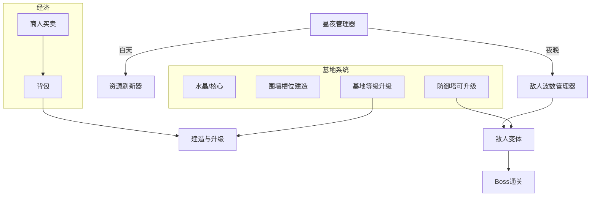

# 2.5D 生存塔防 — 剩余 10 天执行计划（修订）

## 当前状态

*   **剩余时间：** 约 **10 天**（按提交/答辩截止倒推）。
*   **进度（对照原 34 天稿）：** 约 **第 9 天**（`BuildSite`、水晶、墙、塔 MVP 等已做或进行中）。
*   **本版范围约定：** **不做基地领地扩张**（不扩圈、不解锁新地图带）；改为 **基地等级升级**（数值/权限）、**防御塔升级**、**商人买卖**、**敌人变体与强度成长**、**单 Boss + 击败通关**、**HUD / 主界面 / 反馈 / Game Over / 音频**。

---

## 核心架构图

---

## 每日建议投入时间（重要）

| 说明 | 建议 |
|------|------|
| **工作日** | 约 **5～7 小时/天**（含实现 + 自测）。课业紧时至少保证 **4 小时** 连续开发。 |
| **周末** | 可 **6～8 小时/天**，适合做 **商人、Boss、整局串联、打包**。 |
| **10 天合计** | 粗算 **50～65 小时** 有效开发；低于此则必须 **砍功能**（见文末「降级策略」）。 |

> 下列「第 1～10 天」指 **从今天起的 10 个开发日**，不是原 34 天里的第几天。

---

## 第 1～10 天任务排期

### 第 1 天：建造扣资源 + 基地升级（无扩张）

*   **建造：** `BuildSite` 与 `Inventory`（或仓库）对接，墙/塔首次放置 **扣除木材/石料/金币**（按你已有 ItemData 设计）。
*   **基地升级：** 水晶旁或独立交互物：**花费资源/金币 → 基地等级 +1**；等级可影响 **可建塔上限、墙血量系数、商人折扣** 等（选 1～2 项即可，避免做太散）。
*   **明确不写：** 不扩大建造区、不新开墙圈。

**建议工时：** 约 **6 小时**。

---

### 第 2 天：防御塔升级

*   已放置的塔：**交互或 UI** 升级 1～2 级（伤害、射程或射速）。
*   消耗：**金币或材料**，与第 1 天经济同一套。
*   **验收：** 同一槽位可多次升级，数值在 Inspector 可调。

**建议工时：** 约 **6 小时**。

---

### 第 3 天：商人 — 卖东西 & 买东西

*   **商人 NPC**（或固定摊位）：**打开单一 Shop UI**。
*   **卖：** 背包物品 → **金币**（扣物品、加金币）。
*   **买：** 金币 → **商品列表**（材料、可选消耗品；可用 `ItemData` + 价格表）。
*   **验收：** 白天可交易；金币与背包联动无负值。

**建议工时：** 约 **6～7 小时**。

---

### 第 4 天：敌人变体 + 难度成长

*   **至少 2 种变体**（在 Warrior 上改 Prefab / ScriptableObject）：例如 **快速低血**、**慢速高血**；颜色或缩放区分。
*   **`WaveManager`：** 随 **夜晚次数或天数** 增加数量、血量或混入变体比例（先做 **线性或分段**，不必复杂曲线）。
*   **不写：** 血月事件可砍掉，把时间留给 Boss。

**建议工时：** 约 **6 小时**。

---

### 第 5 天：Boss + 击败通关

*   **Boss** 一个：高血量、有辨识度（放大/独用 Sprite/简单阶段可选其一）。
*   **触发：** 例如 **第 N 夜最后一波** 或 **固定天数** 生成。
*   **胜利：** Boss `Health.OnDeath` → **Victory UI**（统计存活天数、击杀可选）→ 可回主菜单。
*   **并行：** **Game Over**（水晶毁）与 **胜利** 两套 UI 文案区分清楚。

**建议工时：** 约 **7 小时**。

---

### 第 6 天：HUD + 主界面

*   **HUD（游戏中）：** 至少 **天数 / 昼夜或阶段 / 水晶血量 / 金币**；键位提示可一行字。
*   **主菜单：** **开始游戏、退出**；可选 **继续** 若你做存档则加，否则不做。
*   **场景流：** `MainMenu` → `Game` → `GameOver`/`Victory` 返回菜单。

**建议工时：** 约 **6 小时**。

---

### 第 7 天：战斗反馈 + 建造反馈

*   **战斗：** 伤害 **飘字** 或 **受击闪白**（二选一必做，另一项有余力再加）；可选屏幕轻震。
*   **建造：** 放置成功 **音效** + 可选 **粒子/缩放动画** 其一。
*   优先接在已有 `Health`、建造确认事件上。

**建议工时：** 约 **5～6 小时**。

---

### 第 8 天：音频

*   **BGM：** 白天 / 夜晚 **各 1 条**（可循环短轨）。
*   **SFX：** 攻击、受伤、UI 点击、建造、升级、商人打开（按需裁剪，**6～10 个**即可）。
*   使用 **AudioMixer** 可选；先保证 **音量不爆、不叠太多同时播**。

**建议工时：** 约 **4～6 小时**（大量时间在找素材与导入）。

---

### 第 9 天：整合测试 + 数值粗调

*   **通玩一局：** 菜单 → 采集 → 建造 → 升级 → 商人 → 多夜 → Boss → 胜利。
*   **修阻塞 Bug**（卡死、空引用、金币错误）。
*   **粗调：** 前几夜能活、Boss 不会无解（时间不够就不做精细平衡表）。

**建议工时：** 约 **6～8 小时**。

---

### 第 10 天：打包、演示、文档

*   **Build** 目标平台自测一遍。
*   **演示视频**（按学校时长）：主菜单 → 核心循环 → 升级/商人 → Boss 通关。
*   **README / 报告用说明：** 系统架构、操作说明、**未实现与可扩展**（如扩张基地留作 Future Work）。

**建议工时：** 约 **5～8 小时**。

---

## 与原「扩张基地」路线的关系

*   **已取消：** 多圈墙扩张、领地解锁新格、Sprint 3 里「扩安全区」等。
*   **保留精神：** 「越来越强」通过 **基地等级、塔升级、商人装备、敌人变体与 Boss** 体现，答辩时说明 **设计取舍** 即可。

---

## 降级策略（时间不够时砍什么）

按 **对答辩伤害从小到大** 建议：

1.  Boss **无阶段**、仅血厚 + 大一点模型。  
2.  敌人变体 **只保留 2 种** + 数值缩放。  
3.  商人 **只买不卖** 或 **只卖材料不买装备**。  
4.  音频 **仅 BGM + 3～4 个关键 SFX**。  
5.  反馈 **只做飘字 + 建造一声**。  

**不要砍：** 通关条件（Boss 死）、Game Over、主菜单、HUD 核心信息、建造扣费与至少一种升级。

---

## 附录：原 34 天分阶段（存档，不再作为当前排期）

历史参考（Sprint 1～6 原稿）

早期版本按 34 天划分昼夜、资源、建造、扩张、血月、全套 UI 等；**当前以本文「剩余 10 天」为准**。若需对照旧任务，可查版本管理历史。

